## Objectifs

- Un package Python spécifique : **Bertopic**
- Prétexte de parler des LLMs et de la représentation sémantique
- Et mettre la main à la pâte

*Une réflexion initiée autour d'un tutorial [The General Inquirer in the time of LLMs: a BERTopic tutorial
](https://css-polytechnique.github.io/css-ipp-materials/pages/bertopic-tutorial.html)*

## Petit tour de table

- Qui a déjà fait du topic modeling ?
- Qui a des notions en Python ?
- Qui est à l'aise avec un notebook ?
- Avez-vous déjà en tête des objectifs ?

## Déroulement

- Petite introduction topic analysis/encodeurs
- Etat des lieux du package Bertopic
- Faire une analyse complète
- Tips avancées & Discussion sur vos usages


# Topic analysis & Bertopic

## Topic models

Méthodes non supervisées pour identifier des structures latentes thématiques dans un ensemble de documents.

- Un corpus +/- grand de textes
- Différentes tâches
    - Lister les thèmes existants
    - Attribuer un/plusieurs thèmes par document
    - Produire des résumés/visualisations
- Différentes méthodes
    - Regex, Latent Dirichlet Allocation, Non-Negative Matrix Factorization, etc.

## Quand les utiliser ?

- Exploratoire : avoir une vision générale de son corpus (surtout quand il est large), identifier les outlayers, mieux anticiper le filtrage, ...
- En cours d'analyse : sélectionner une diversité de source, avoir des catégories pour annoter ses éléments, ...
- Confirmatoire : mettre à l'épreuve un cadre d'analyse

Une interface quanti (corpus) / quali (thèmes)

## Des familles très différentes

- Extraire des classes latentes
    - Un document peut être un mélange de différentes classes
    - Iramuteq, LDA, ...
- Regrouper les textes semblables dans des mêmes groupes
    - Chaque document a un groupe
    - Bertopic

« BERTopic was ranked first by 8 out of 12 participants (67%), LDA by 3 out of 12 participants (25%), and NMF by 1 out of 12 participants (8%). » ([Kaur et Wallace, 2024, p. 11](zotero://select/library/items/7PY7MLWK)) ([pdf](zotero://open-pdf/library/items/JBUIEGJE?page=11&annotation=R9HLNF9T))

## Au coeur : la représentation des textes

- Approche par les mots - sac de mots ou de n-grams (DTM, TF-IDF, ...)
- Approches par les plongements sémantiques

](./img/representation){fig-align="center"}

## Un mot sur les plongements sémantiques

Ou **embeddings** avec représentation du contexte

{fig-align="center"}

Ce ne sont plus les mots, mais les sens des mots/phrases

## Brique centrale : les modèles encodeurs

- Modèles pré-entrainés
    - Sur des corpus/langues
- De nombreux modèles open weights/open source
    - Par exemple HuggingFace
    - Tailles, génération, ...
- Des contraintes
    - GPU
    - Fenêtre de contexte

:::{.callout-note}

AM : Mettre plus tard?

:::

## Bertopic dans tout ça ?

Un package Python qui facilite la manipulation de ces distances sémantiques pour extraire des thèmes (et faire plein d'autres choses : visualiser, etc.)

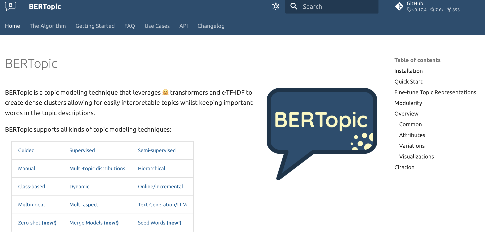{fig-align="center"}

« they valued BERTopic’s ability to uncover hidden connections, emphasizing the need for meaningful, comprehensive analysis tools that support their research objectives and enhance data interpretation » ([Kaur et Wallace, 2024, p. 2](zotero://select/library/items/7PY7MLWK)) ([pdf](zotero://open-pdf/library/items/JBUIEGJE?page=2&annotation=ZZRXF56E))

## La philosophie du package

- tirer parti des embeddings / BERT
    - `sentence-transformers`
- réfléchir la représentation des clusters au-delà du centroid
- des sorties graphiques visuelles faciles à intérpéter
- favoriser la modularité

Grootendorst, Maarten. 2022. « BERTopic: Neural Topic Modeling with a Class-Based TF-IDF Procedure ». arXiv:2203.05794. Prépublication, arXiv, mars 11. https://doi.org/10.48550/arXiv.2203.05794.

## Ce qu'il fait

Un pipeline de méthodes de machine learning

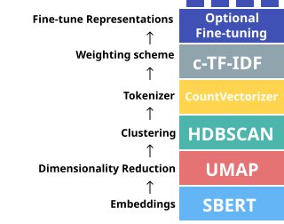{fig-align="center"}

## Qui permettent la modularité

Et donc de s'adapter aux enjeux spécifiques du traitement

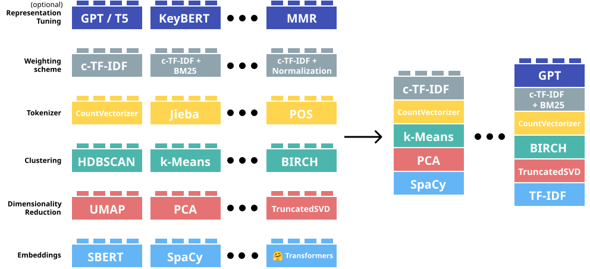{fig-align="center"}

## Une adoption en croissance

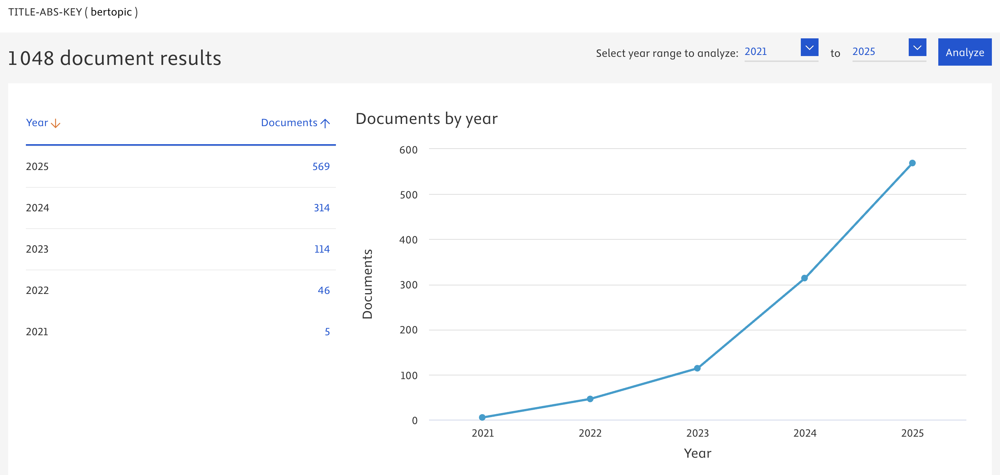{fig-align="center"}

## Quelques débats ... pas toujours très justes

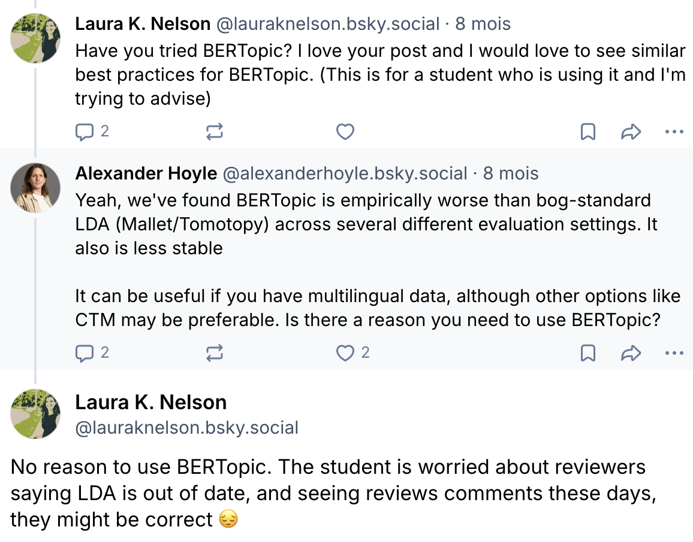{fig-align="center"}

ex *TopicGPT: A Prompt-based Topic Modeling Framework* : paramètres par défaut sans aucune réflexion sur le fonctionnement du package. <!-- AM: Je comprends pas ce que ça vient faire là dedans, je connais pas TopicGPT. ça a un lien avec BERTopic? (autre que topic modelling j'entend) -->

## De bonnes raisons de tester Bertopic (au moins)

- Package bien pensé et facile d'usage
- Mobilise la puissance des modèles pré-entrainés
- Hautement configurable pour les cas particulier
- Tire parti des modèles BERT récents


# Passer à la pratique

## Les ressources

- Un notebook (ouvrir sur [Github](https://github.com/emilienschultz/slides-bertopic/blob/main/material/notebook.ipynb), ouvrir sur [Colab](https://githubtocolab.com/emilienschultz/slides-bertopic/blob/main/material/notebook.ipynb))
- [Corpus sur Zenodo](https://zenodo.org/records/17936091)

**Pour la séance**

1. **Obtenir le notebook**
    - Si vous travaillez sur votre ordinateur: clonez le dépôt [https://shorturl.at/lwzAS](https://shorturl.at/lwzAS)
    - Si vous travaillez sur Colab: se rendre sur [https://shorturl.at/i0h68](https://shorturl.at/i0h68)
    - Si SSPCloud ??
2. **Obtenir les données**<br/>
    - se rendre sur la page Zenodo
    - Télécharger le fichier: `theses-soutenues-curated-stratified.csv` et `embeddings.zip`
    - Si local : placer les fichiers dans le dossier de travail
    - Si Colab : téléverser les fichiers dans l'espace de travail 
3. **Préparer l'environnement virtuel**
    - lancer la première cellule du notebook qui télécharge les requirements et les installe. 

## Le cas d'usage

- Un jeu de données public: [Thèses soutenues en France depuis 1985](https://www.data.gouv.fr/datasets/theses-soutenues-en-france-depuis-1985)
    - référence les thèses défendues en France avec un abstract en français et en anglais dans la plupart des cas
    - Données textuelles de qualité: peu de retouches à faire dans les textes eux mêmes, format et longueur standardisée. *Nota, un travail de nettoyage a quand même été réalisé en amont.*
    - Des métadonnées présentes: des catégories standardisées sont renseignées pour chaque thèse. Leur qualité est inconnue.
    - Par ailleurs, le travail sur des résumés de thèse est pratique courante (Ma et al., 2025; Ollion et al., 2025)
- Une tâche simple: **Retrouver les disciplines explorées par les thèses défendues en France grâce au topic modelling.**

:::{.notes}

Nettoyage réalisé: 

- select only thesis defended between 2010 and 2022, since information before that time is of lower quality
- select thesis where both resumes in english and french exist, as well as the oai code (correspond to the field of the thesis, see oai_codes.csv in the Zenodo project). (about 37% of the dataset remains, representing about 166k rows).
- aggregate the topics (sujets rameaux) together under a single column (previously 53 (!!!))
- check that the provided resume under the english column is written in english, and the resumes under the french column are written in french. If the english version is in the french column and vice-versa, swap them.
- Finally, only select the rows where the resumes in english are in english and the resumes in french are in french. (36% of the original dataset, representing about 164k rows)
- Add an index to the dataset

Papiers cités: 

- Ollion, E., Boelaert, J., Coavoux, S., Delaine, E., Desprès, A., Gollac, S., Keyhani, N., & Mommeja, A. (2025). La part du genre. Genre et approche intersectionnelle dans les sciences sociales françaises au XXIe siècle. https://doi.org/10.31235/osf.io/qamux_v2
    - utilisent les résumés de thèses en sociologie pour détecter les papier qui mentionnent le genre et analyser l'évolution du nombre de mention à travers les années.
- Ma, L., Chen, R., Ge, W., Rogers, P., Lyn-Cook, B., Hong, H., Tong, W., Wu, N., & Zou, W. (2025). AI-powered topic modeling : Comparing LDA and BERTopic in analyzing opioid-related cardiovascular risks in women. Experimental Biology and Medicine, 250, 10389. https://doi.org/10.3389/ebm.2025.10389
    - utilisent le The PubMed abstract collection pour comparer les méthodes de topic modelling

XXX D'autres papiers? 

:::

# Aperçu de la pipeline et de son fonctionnement

## Lancer son premier topic model avec BERTopic

```python 
import pandas as pd
from bertopic import BERTopic

df = pd.read_csv("./theses-soutenues-curated-stratified.csv")
docs = df["resumes.fr"].sample(1000).to_list()
topic_model = BERTopic(language="french")
topic_model.fit(documents=docs)
```

. . . 

{fig-align="center"}

:::{.notes}

The dataset contains the following columns:

- CI: Custom index, values are CI-XXXX, with XXXX ranging from 0 to 164,378
- year: the year of the defence, values are integers ranging from 2010 to 2022
- oai_set_specs: the oai code, each code looks like ddc:XXX, for instance ddc:300 refers to Sciences sociales, sociologie, anthropologie.
- resumes.en and resumes.fr: the abstract of the PhD dissertation, respectively in English and French. We are sure that every row contains a valid abstract in the right language thanks to the data curation.
- titres.en and titres.fr: the titles of the PhD dissertation, respectively in English and French. Only 5% of the rows do not have a valid title (French or English). The language of the titles has not been checked because it will only be used to check the qualitative validity of topic model.
- topics.en and topics.fr: the aggregated topics provided by the author. Only 5% of the rows do not have valid topics (French or English). The language of the topics has not been checked because they will only be used to check the qualitative validity of topic model.

::: 

## Voyons ce que ça donne - Retrouver les thèmes

On cherche à afficher les thèmes identifiés, et les représenter avec des mots clefs.

```python 
topic_model.get_topic_info()
```

|   Topic |   Count | Representation                                                        |
|--------:|--------:|:----------------------------------------------------------------------|
|      -1 |     302 | ['de', 'la', 'des', 'et', 'les', 'le', 'une', 'en', 'dans', 'un']     |
|       0 |     178 | ['de', 'la', 'des', 'et', 'les', 'le', 'dans', 'une', 'un', 'en']     |
|       1 |     117 | ['de', 'la', 'et', 'les', 'des', 'le', 'du', 'en', 'un', 'une']       |
|       2 |     108 | ['de', 'des', 'la', 'les', 'et', 'une', 'le', 'un', 'pour', 'en']     |
|       3 |     100 | ['de', 'des', 'la', 'et', 'en', 'les', 'été', 'dans', 'le', 'une']    |
|       4 |      49 | ['de', 'des', 'et', 'les', 'la', 'en', 'du', 'une', 'le', 'sur']      |
|       5 |      48 | ['de', 'et', 'la', 'les', 'des', 'une', 'en', 'le', 'dans', 'du']     |
|       6 |      41 | ['la', 'de', 'et', 'le', 'du', 'les', 'une', 'des', 'en', 'dans']     |
|       7 |      31 | ['la', 'de', 'et', 'les', 'le', 'des', 'en', 'du', 'langue', 'dans']  |
|       8 |      13 | ['de', 'la', 'des', 'et', 'les', 'en', 'une', 'du', 'le', 'au']       |
|       9 |      13 | ['de', 'la', 'et', 'un', 'les', 'pression', 'le', 'une', 'en', 'des'] |

## Voyons ce que ça donne - Afficher les documents dans un espace 2D

On cherche à afficher les documents dans un espace 2D pour identifier la taille des clusters et leurs position relative.

```python 
topic_model.visualize_documents(docs = docs,hide_annotations = True)
```

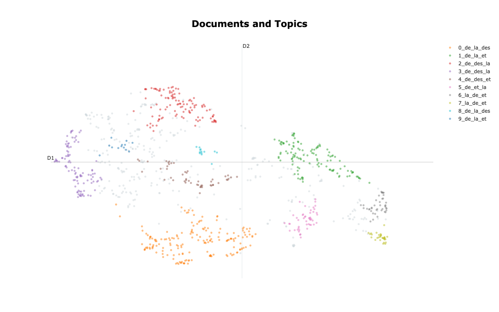{fig-align="center"}


:::{.notes}

Commenter sur le fait que c'est loooong

On peut quand même déjà essayer de se repérer mais c'est pas évident

:::

## Voyons ce que ça donne - Afficher les mots clefs

On cherche à afficher les mots clefs de chaque thème pour facilement les comparer 

```python 
topic_model.visualize_barchart()
```

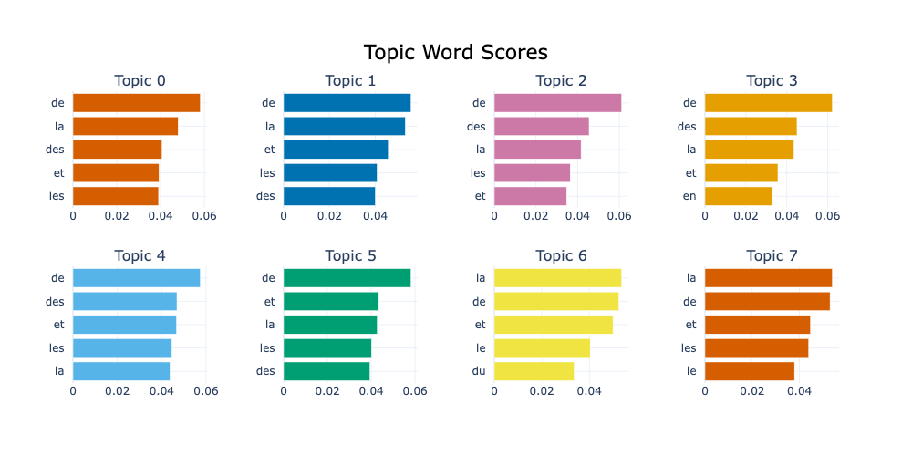{fig-align="center"}

## Voyons ce que ça donne - Tentons d'évaluer le modèle 

```python
# code_oai = "ddc:300" # "Sciences sociales, sociologie, anthropologie",
# code_oai = "ddc:340" # "Droit",
# code_oai = "ddc:004" # "Informatique",
# code_oai = "ddc:570" # "Sciences de la vie, biologie, biochimie",
# code_oai = "ddc:540" # "Chimie, minéralogie, cristallographie",
# code_oai = "ddc:620" # "Sciences de l'ingénieur",
# code_oai = "ddc:550" # "Sciences de la terre",
code_oai = "ddc:530" # "Physique",
# code_oai = "ddc:510" # "Mathématiques",
# code_oai = "ddc:610" # "Médecine et santé"

doc_contains_code_oai = df_sample["oai_set_specs"].apply(lambda s: code_oai in s.split("||"))
topics_per_class = topic_model.topics_per_class(docs, classes=doc_contains_code_oai)
topic_model.visualize_topics_per_class(topics_per_class)
```

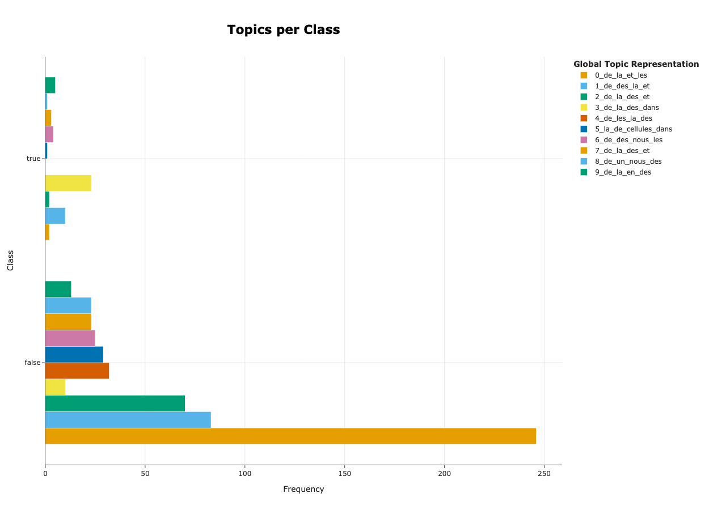{fig-align="center"}

:::{.notes}

Marchent bien: Physique, Sciences de l'ingénieur, Informatique

:::

## Conclusion de la pipeline vanilla

- On a des outils utiles et qui sont rapides à mettre en place.
- Dans l'état, on en apprend rien et on peut rien n'en faire.
- Dans l'état il est difficile d'évaluer la pertinence du topic modelling.

# Comprendre la pipeline pour obtenir de meilleurs résultats 

## Rappel de la pipeline 


## Embeddings avec SBERT 

- Hyperparamètres impliqués: modèle de plongement 
- Objectif: Représenter les données textuelles en vecteurs qui permettent de rapprocher des documents sémantiquement proches.
- Technique employée: [Sentence Transformers](https://huggingface.co/sentence-transformers) (SBERT), un package Python maintenu par [HuggingFace](https://huggingface.co/).

## Down the rabbit hole: HugginfFace c'est quoi ? 

::::{.columns}

::: {.column width="80%"}

- 🤗 **HuggingFace**: Entreprise privée qui se place comme une plateforme d'échange autour du NLP et du Machine Learning 
- Qu'est ce qu'on y échange: 
    - **Des modèles**: possibilité de téléverser et télécharger des modèles, explorer les modèles en fonction de la langue la tâche etc. ainsi que consulter des benchmarks.
    - **Des données**: possibilité de téleverser et télécharger des données.
    - **Des conseils d'implémentation**: à travers des tutoriels, des projets exemple, de la documentation mais aussi des articles et un forum actif.
- Qu'est ce qu'on peut y faire de plus?
    - Entraîner des modèles sur leur matériel
    - Héberger des modèles d'inférence sur leur matériel

:::

::: {.column width="20%"}


:::

::::

## Down the rabbit hole: Modèles de plongement c'est quoi ?

- **Avec les mains**: un modèle est une fonction qui accepte des textes et renvoie une représentation numérique qui encapsule la sémantique du texte. La sémantique est relative, c'est à dire qu'on mesure surtout la similarité sémantique de deux textes à travers le produit cosinus.  
- **Dans les faits**: 
    - Un modèle est une suite de multiplication et d'addition de matrices (les poids/biais).
    - Les poids sont optimisés sur une tâche ayant pour but de modéliser la sémantique relative des textes. 
    - Le résultat de cet optimisation / entraînement est un modèle pré-entraîné.
- **Les détails d'importance**
    - *Le pré-traitement des textes*: pas de suppression des stop-words ou de la ponctuation. On retire que ce qu'on considère comme "bruit" (balises HTML, emojis, fautes d'orthographe, ...)
    - *La taille des textes*: les modèles ont une taille limite de textes admissibles, la **fenêtre de contexte**. 
    - *La taille des modèle*: un gros modèle nécessite une grande puissance de calcul en CPU voire GPU.
    - *Les tâches de prétraitement*: le choix de la tâche d'entraînement et du corpus (langue, domaine) signifie que des modèles pré-entraînés seront plus performants sur certains corpus et certaines tâches et moins sur d'autres: **Il faut tester !**

XXX: trouver un ordre de grandeur de la taille de corpus de pré-entraînement

## Down the rabbit hole: Calculer les plongements en amont - Le code  

```python 
from datasets import Dataset
from gc import collect as gc_collect
from sentence_transformers import SentenceTransformer
from torch.cuda import is_available as cuda_available
from torch.cuda import synchronize, ipc_collect, empty_cache

ds = Dataset.load_from_disk("...")
# implement your preprocess and open functions
texts : list[str] = preprocess(ds["texts"]) 
# Use GPU if you have one
device = "cuda" if cuda_available() else "cpu" 

sbert_model = SentenceTransformer(model_name, device = device, trust_remote_code = True)
sbert_model.max_seq_length = min(
    sbert_model.max_seq_length,
    np.inf # Replace with desired window size
)

try : 
    embeddings = sbert_model.encode(texts, device=str(device), normalize_embeddings=True, show_progress_bar=True)
    ds = ds.add_column("embedding", list(embeddings))
    ds.save_to_disk("embeddings")
except Exception:
    print(Exception)
finally:
    # Make sure to clean your GPU
    del sbert_model, ds
    empty_cache()
    if cuda_available():
        synchronize()
        ipc_collect()
    gc_collect()
```

## Mise à jour de la routine BERTopic  

On tire avantage du pré-calcul des plongements et on les fournit au topic model: 

```python 
from datasets import load_from_disk
import numpy as np 

ds = load_from_disk(f"./embeddings/all-MiniLM-L6-v2-fr-SBERT")
docs = np.array(ds[f"resumes.fr"])      # 6500 rows
embeddings = np.array(ds["embedding"])  # Shape: 6500 x 768

topic_model = BERTopic(language = "french")
topic_model.fit(documents=docs, embeddings=embeddings)
```

Les résultats sont les mêmes, mais le temps de calcul se voit fortement réduit! 

## Impact du changement de modèle

::::{.columns}

:::{.column width="50%"}

{width="40%"}

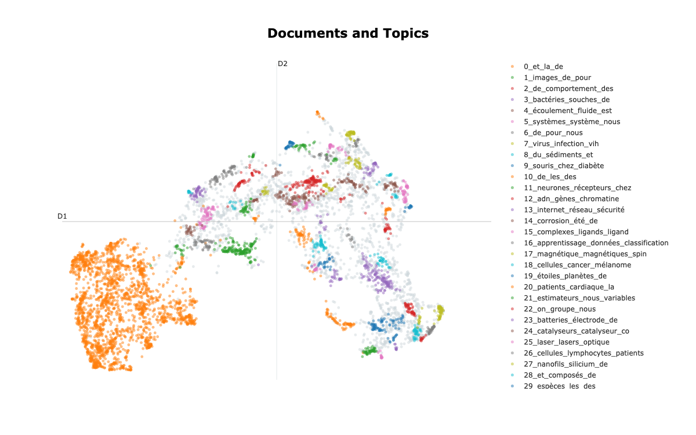{width="40%"}

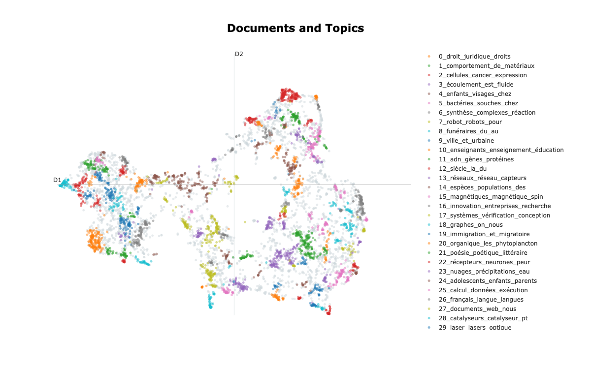{width="40%"}

:::

:::{.column width="50%"}

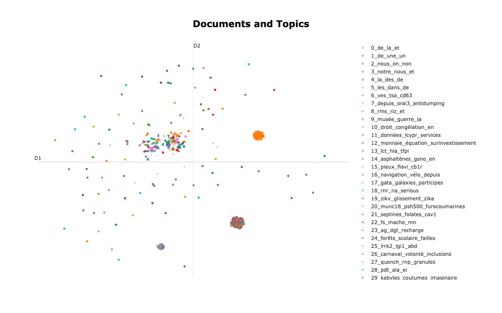{width="40%"}

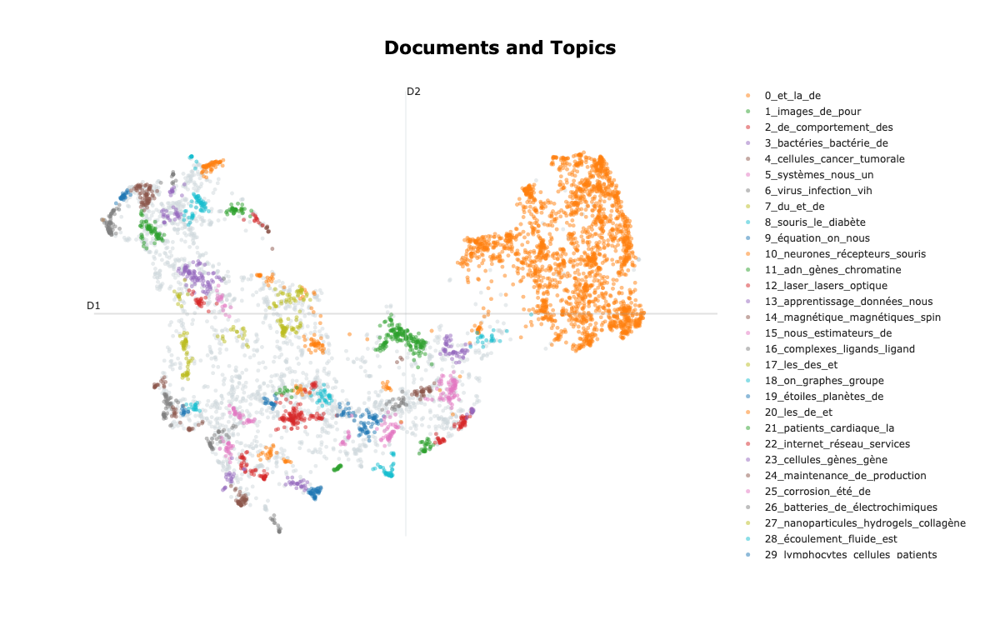{width="40%"}

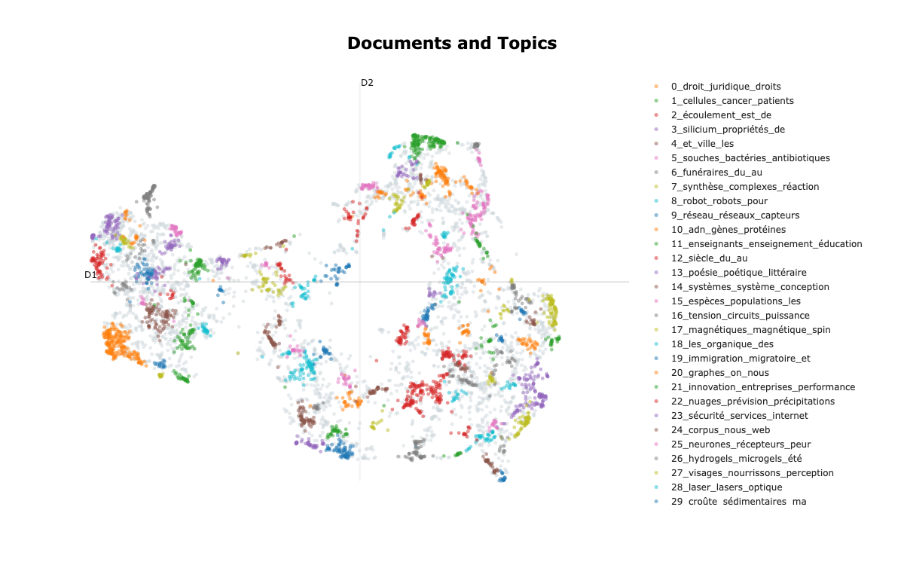{width="40%"}

:::

::::

Pour la suite on va utiliser `gte-multilingual-base-fr-SBERT`.

## Réduction de dimensionalité avec UMAP 

- Hyperparamètres impliqués: `n_neighors` et `n_components` _(conserver `min_dist=0.`)_. 
- Objectif: Réduire le nombre de dimension (i.e. la taille des vecteurs) pour passer de plusieurs centaines à 2-10.
- Technique employée: UMAP _(Uniform Manifold Approximation and Projection)_, une technique qui cherche à reconstruire un réseau de distances relatives en plus basse dimension de manière itérative. D'autres techniques sont possibles: PCA ou t-SNE.

](./img/umap.png)

Ressource pour jouer avec les paramètres: [Understanding UMAP](https://pair-code.github.io/understanding-umap/)

## Mise à jour de la routine BERTopic  

```python 
from umap import UMAP

ds = load_from_disk(f"./embeddings/all-MiniLM-L6-v2-fr-SBERT")
docs = np.array(ds[f"resumes.fr"])      # 6500 rows
embeddings = np.array(ds["embedding"])  # Shape: 6500 x 768

umap_model = UMAP(
    n_neighbors = 50,
    # Default parameters
    metric = "cosine",
    n_components = 5,
    min_dist=0.0,
    low_memory = False 
)


topic_model = BERTopic(language = "french", umap_model= umap_model)
topic_model.fit(documents=docs, embeddings=embeddings)
```

## Impact du changement de `n_neighbors`

::::{layout-ncol=2}

{width="70%"}

{width="70%"}

{width="70%"}

:::{.callout-warning font-size="1rem"}

<span style="font-size:.8rem;">Attention, en fonction de la taille du corpus, une valeur "raisonnable" de `n_neighbors` va changer !</span>

<span style="font-size:.8rem;">🚨Attention🚨 ici la représentation visuelle ne change pas, malgré qu'on ai changé `n_neighbors`. C'est normal, en réalité il y a 2 UMAP:</span>

- <span style="font-size:.8rem;">premier UMAP: celui appliqué sur les embeddings, qui réduit à 5 dimensions, avec la valeur de `n_neighbors` choisie, et dont les vecteurs résultants (en 5D), et sur lequel on applique l'algorithme de clustering.</span>
- <span style="font-size:.8rem;">deuxième UMAP: celui appliqué lorsqu'on utilise la fonction `topic_model.visualize_documents`, qui réduit les embeddings à 2 dimensions, et utilise `n_neighbors=10`. D'où le fait que la visualisation ne bouge pas.</span>

:::

::::

## Impact du changement de `n_components`

. . .

{width="50%"}

## Clustering avec HDBSCAN

- Hyperparamètres impliqués: `min_cluster_size`. 
- Objectif: Créer des groupes à partir de patterns de proximité.
- Technique employée: HDBSCAN une technique de clustering qui cherche des clusters denses sans présupposer de leur forme et en acceptant que certains points soient considérés comme "bruit". D'autres techniques sont possibles: DBSCAN, K-means.

](./img/hdbscan.png){fig-align="center"}

Ressource pour comprendre HDBSCAN: [Documentation HDBSCAN - How HDBSCAN Works](https://hdbscan.readthedocs.io/en/latest/how_hdbscan_works.html)

## Mise à jour de la routine BERTopic  

```python 
from hdbscan import HDBSCAN

ds = load_from_disk(f"./embeddings/all-MiniLM-L6-v2-fr-SBERT")
docs = np.array(ds[f"resumes.fr"])      # 6500 rows
embeddings = np.array(ds["embedding"])  # Shape: 6500 x 768

hdbscan_model = HDBSCAN(
    min_cluster_size=50, 
    # Default parameters 
    prediction_data=True
)

topic_model = BERTopic(language = "french", hdbscan_model=hdbscan_model)
topic_model.fit(documents=docs, embeddings=embeddings)
```

## Impact de `min_cluster_size` 

::::{layout-ncol=2}

{width="70%"}

{width="70%"}

{width="70%"}

:::{.callout-warning font-size="1rem"}

Attention, en fonction de la taille du corpus, une valeur "raisonnable" de `min_cluster_size` va changer !

:::

::::

## Proposer des mots clefs avec CountVectorizer et c-TF-IDF 

- Hyperparamètres impliqués: Retirer les stop words (`n_gram_range=(1, 1) ou (1,2)`).
- Objectif: Identifier des mots clefs et les pondérer pour faire ressortir les mots clefs qui sont représentatifs d'un groupe et qui les différentie des autres.
- Technique employée: Compter les mots avec CountVectorizer (scikit learn) et pondérer les scores avec c-TF-IDF. D'autres techniques sont possibles: hormis cas spécial, conserver ces blocs.

:::{.notes}

jieba -> langue mandarin
POS (part of speach vectorizer, avec spacy (jcrois)) -> je vois pas l'intérêt immédiat

:::

## Mise à jour de la routine BERTopic  

```python 
from sklearn.feature_extraction.text import CountVectorizer
from stopwordsiso import stopwords

ds = load_from_disk(f"./embeddings/all-MiniLM-L6-v2-fr-SBERT")
docs = np.array(ds[f"resumes.fr"])      # 6500 rows
embeddings = np.array(ds["embedding"])  # Shape: 6500 x 768

vectorizer_model = CountVectorizer(stop_words = list(stopwords("fr")))


topic_model = BERTopic(language = "french", vectorizer_model = vectorizer_model)
topic_model.fit(documents=docs, embeddings=embeddings)
```

## Impact du fait de retirer les stopwords

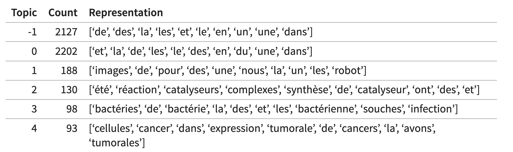{fig-align="center" width="65%"}

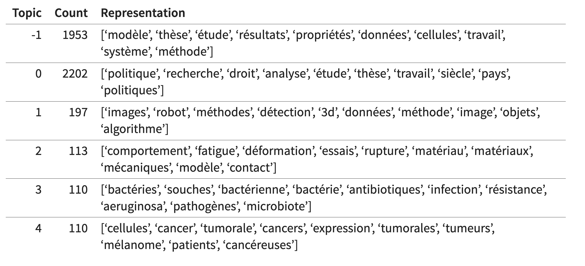{fig-align="center" width="65%"}


## Annexe : Evaluer les topic models

Une histoire compliquée « standard metrics may not reliably reflect human perception of coherence in specialized fields » ([Prouteau et al., 2026, p. 8](zotero://select/library/items/C82A8VFG)) ([pdf](zotero://open-pdf/library/items/TG8C8RFU?page=8&annotation=MWE32PG3))

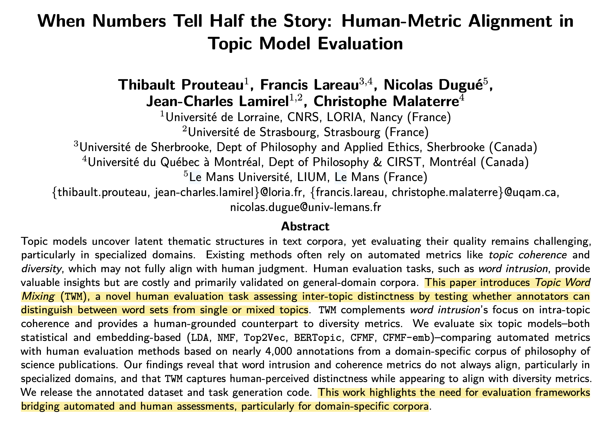{fig-align="center"}


## Annexe : Quelques limites/discussion

- Dépendance au modèles :
    - biais, zones aveugles, etc.
    - comment comparer
- De nombreux paramètres qui nécessitent d'être au clair 
- Nécessite des infrastructures pour scale
- « First, BERTopic assumes that each document only contains a single topic which does not reflect the reality that documents may contain multiple topics. » ([Grootendorst, 2022, p. 8](zotero://select/library/items/5U4PXYBD)) ([pdf](zotero://open-pdf/library/items/QHZSJIAA?page=8&annotation=GK2XMW4K))

---

## Annexe : Utiliser ActiveTigger

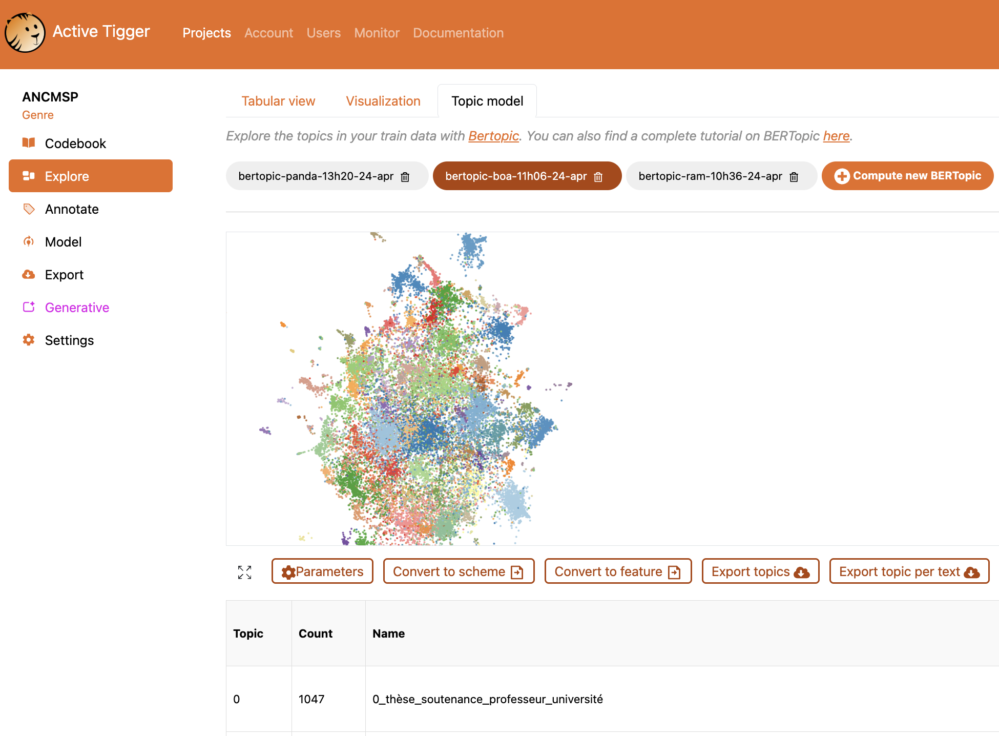{fig-align="center"}


# Mettre en forme son corpus

## Avant Bertopic

- Des documents dans des formats différents
- Des longueurs variables
    - Limite de la fenêtre de contexte
- Du nettoyage à faire

---

## Comment découper son corpus ?